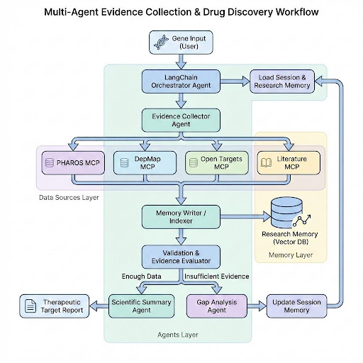

# Drug Discovery Agent

> **Note:** I am currently working on this project. It is a work in progress.

A multi-agent drug discovery system where a LangChain orchestrator coordinates specialized agents to collect gene-related evidence from biomedical sources (PHAROS, DepMap, Open Targets, and literature MCPs). A validation agent evaluates evidence completeness using shared memory, enabling iterative data collection before a summary agent generates a therapeutic target discovery report.

---

## 🏗️ Project Architecture

The system is built on a modular "Orchestrator-Compiler" pattern. It uses **LangGraph** to manage the stateful collection of evidence from four distinct MCP sources, followed by a high-fidelity synthesis step.

### System Overview

<div align="center">
  
</div>
  Drug Discovery Agent Phase1


---

## 🚀 Key Features

- **Multi-Source Intelligence**: Aggregate data from DepMap, PHAROS, Open Targets, and Europe PMC.
- **Agentic Orchestration**: Deterministic LangGraph workflow for validation, parallel collection, and synthesis.
- **Clinical-Grade Reporting**: Generates 9-section therapeutic dossiers following pharmaceutical standards.
- **Standalone MCP Components**: Includes modular [DeepMap MCP](https://github.com/Saurabhsing21/Deepmap-mcp) and [Literature MCP](https://github.com/Saurabhsing21/Literature-MCP) servers.
- **Deep Traceability**: 1:1 mapping between every claim and its source evidence record.

---

## 📝 Integrated Evidence Dossiers (Results)

The agent generates professional pharmaceutical-grade reports. View some of our latest tested targets:

- **[EGFR Summary Report](results/EGFR_summary.md)** - RTK Inhibitor Target (High Clinical Maturity)
- **[TP53 Summary Report](results/TP53_summary.md)** - Tumor Suppressor (Complex Tractability)
- **[KRAS Summary Report](results/KRAS_summary.md)** - GTPase (Diverse Disease Associations)
- **[BRCA1 Summary Report](results/BRCA1_summary.md)** - DNA Repair (Strong Cancer Links)
- **[MYC Summary Report](results/MYC_summary.md)** - Transcription Factor (High Dependency)

---

## 🛠️ Local Setup

### 1. Prerequisites
- **Python 3.10+**
- **Node.js 18+** (Required for the Pharos MCP server)
- **OpenAI API Key** (For synthesis reports)

### 2. Installation
```bash
python3 -m venv venv
source venv/bin/activate
pip install -r requirements.txt
cp .env.example .env
```

### 3. Initialize External MCP Servers
The agent manages background processes automatically, but requires local dependencies:
```bash
cd external_mcps/pharos-mcp-server
npm install
cd ../..
```

### 4. Download Bioinformatics Data (Required)
For the DepMap collector to work, you must download the CRISPR gene effect dataset (~300MB). This is required because large biological datasets are not stored in Git:

```bash
python3 scripts/download_depmap.py
```

---

## 📖 Usage

### Running a Query
```bash
# Basic run for a gene
python3 -m cli run --gene KRAS

# High-depth search (Top-K control)
python3 -m cli run --gene TP53 --top-k 15

# Change LLM Model on the fly
python3 -m cli run --gene EGFR --model o1
```

### Interactive REPL
```bash
python3 -m cli repl
```

---

## 📄 License
MIT © 2026 Drug Discovery Agent Contributors.
