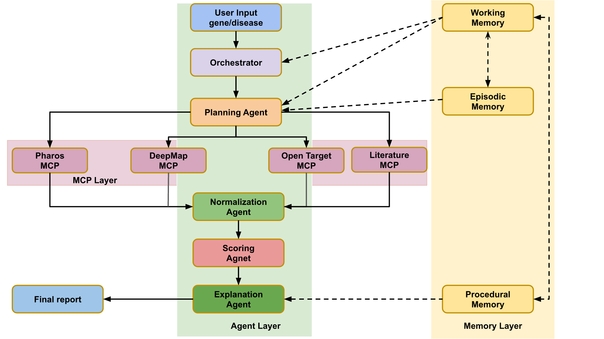

# 💊 Drug Discovery Agent

> **Enterprise-Grade Multi-Agent System for Biomedical Research** 🚀

A high-fidelity drug discovery ecosystem that orchestrates specialized LLM agents and deterministic logic modules to aggregate, verify, and synthesize gene-disease evidence from global biomedical databases using the **Model Context Protocol (MCP)**.

---

## 🏗️ Core Architecture

The system is built on a modular "Orchestrator-Compiler" pattern using **LangGraph**, managing a stateful pipeline designed for maximum reliability, traceability, and speed.

<div align="center">
  
</div>

For the detailed scoring + normalization architecture (including formulas and conflict logic), see `docs/architecture_diagram.md`.

### 1. Agent Layer (The Intelligence)
The agent layer consists of specialized LLM-powered nodes that handle reasoning, planning, and synthesis:
*   **Orchestrator (Supervisor Agent)**: The central controller that manages the state machine, decides when to move between stages, and handles human-in-the-loop triggers for high-severity conflicts.
*   **Planning Agent**: Analyzes research objectives and historical context to define custom collection strategies, ordering sources, and providing per-source directives.
*   **MCP Runtime Nodes**: A suite of specialized connectors (DepMap, Pharos, Open Targets, Europe PMC) that execute the planned collection strategy using standardized tool calls.
*   **Synthesis & Validation Agents**: Specialized nodes for data normalization, conflict interpretation, and final dossier generation.

### 2. Memory Layer (The Context)
A sophisticated 5-layer memory system ensures every research cycle is context-aware and persistent:
*   **Episodic Memory**: Tracks historical runs, including gene targets, disease contexts, and final decisions to inform future planning.
*   **Working Memory**: Maintains a stage-by-stage snapshot of the current execution, ensuring no data is lost during the flow.
*   **Semantic Memory**: Stores curated biomedical knowledge, including gene/disease aliases and canonical mappings.
*   **Procedural Memory**: Captures the specific configuration, prompt hashes, and collector sequences used in a run for reproducibility.
*   **Content Memory**: Injects curated project context and mission-specific documents into every LLM prompt to maintain alignment with research goals.

---

## 📄 Gene Discovery Report

Every execution generates a professional, pharmaceutical-grade dossier with 1:1 traceability to source evidence. The report includes:

*   **Executive Summary**: A high-level decision on the target's therapeutic potential based on aggregate evidence.
*   **Source Coverage**: Detailed breakdown of successes, record counts, and latencies across all queried databases.
*   **Evidence Tables**: Compiled and ranked evidence for Target Annotation, Genetic Dependency (CRISPR), and Disease Association.
*   **Cross-Source Conflicts**: Identification and weighting of contradictory evidence to highlight research risks.
*   **Next step recommendations**: Strategic suggestions for further in-silico or in-vitro validation.

---

## 📊 Example Research Results

Explore real-world outputs generated by the agent for various gene targets:

*   [EGFR Research Dossier](results/EGFR_summary.md)
*   [BRAF Research Dossier](results/BRAF_summary.md)
*   [KRAS Research Dossier](results/KRAS_summary.md)
*   [TP53 Research Dossier](results/TP53_summary.md)

---

## 🛠️ Technology Stack

| Category | Technologies | Key Features |
| :--- | :--- | :--- |
| **AI Orchestration** | LangGraph, LangChain, MCP | Stateful DAGs, Tool-calling standardization, Parallel Dispatch |
| **LLM Models** | OpenAI (o1/4o), Google Gemini 2.0 | Reasoning-heavy synthesis, Automated model fallbacks |
| **Backend Core** | Python 3.10+, Pydantic V2, Asyncio | Type-safe schemas, High-concurrency data collection |
| **Memory System** | JSON-based storage, Multi-layer persistence | Context-aware research cycles, Stable reproducibility |
| **Infrastructure** | Docker, Docker Compose, Nginx | Fully containerized, Reverse proxy, Production-ready |
| **Frontend UI** | Next.js, TailwindCSS, Shadcn/UI | Real-time monitoring, Human-in-the-loop review gates |
| **Data Sources** | DepMap, Pharos, Open Targets, EPMC | Federated biomedical data retrieval via specialized MCPs |

---

## 🚀 Key Features

*   **Multi-Model Intelligence**: Native support for **OpenAI (o1/GPT-4o)** and **Google Gemini 2.0** with automated reasoning fallbacks.
*   **Agentic Memory Ecosystem**: A sophisticated 5-layer memory system (Episodic, Working, Semantic, Procedural, Content) ensuring every run is context-aware.
*   **Clinical-Grade Validation**: Combines LLM qualitative assessment with deterministic quantitative checks to eliminate hallucinations.
*   **MCP-First Integration**: Highly extensible architecture using the Model Context Protocol to decouple data sourcing from core logic.
*   **Full Observability**: Real-time telemetry, stage-by-stage snapshots, and comprehensive execution traces.

---

## 🚢 Infrastructure & Deployment

The project is designed for enterprise deployment with a full orchestration stack:
*   **Dockerized Services**: Multi-container setup separating the UI API, Frontend, and MCP servers.
*   **Nginx Gateway**: Secure reverse proxy and static asset serving.
*   **Telemetry Layer**: Centralized event logging and performance monitoring via `prompt_trace` and `telemetry` modules.

### Deployment Quickstart
```bash
cd deploy
docker compose up -d --build
```

---

## 🚀 Quick Start & Setup

### 1. Prerequisites
- **Python 3.10+**, **Node.js 18+**, and **Docker**.
- Valid API keys for OpenAI/Google (configured in `.env`).

### 2. Installations
```bash
git clone https://github.com/Saurabhsing21/Drug-disovery-agent.git
cd Drug-disovery-agent
python3 -m venv venv && source venv/bin/activate
pip install -r requirements.txt
python3 scripts/download_depmap.py # Download required CRISPR datasets
```

### 3. CLI Execution
Run headlessly for any gene target to generate a report:
```bash
# Run headlessly for any gene target
python3 -m cli run --gene EGFR --save-markdown
```

---

## 👨‍💻 Developed By
**Saurabh Singh** (Saurabhsing21)

---

## 📄 License
MIT © 2026 Drug Discovery Agent Contributors.
