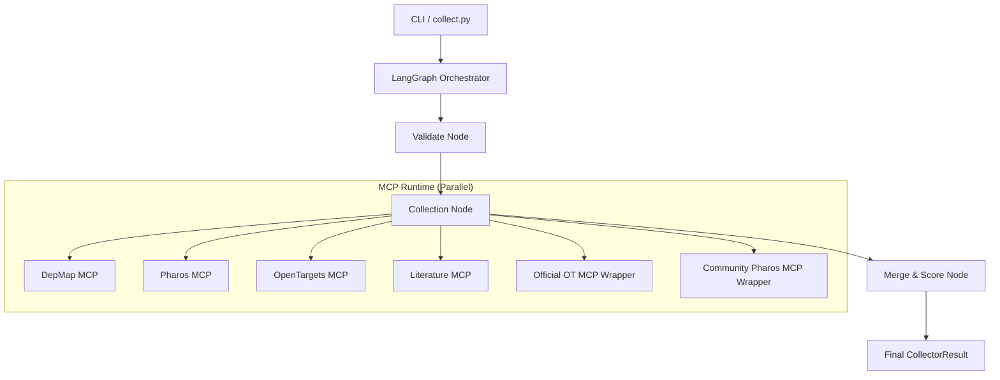

# Agent4Target Architecture: End-to-End Flow

This document describes how the evidence collection agent works from User Input to the Scored Result.

---

## 1. High-Level Overview
The system is built on a **Multi-Agent Orchestration** pattern using **LangGraph** and the **Model Context Protocol (MCP)**. It aggregates biological evidence (genetic dependencies, disease associations, literature) and normalizes it into a unified score.

---

## 2. The Step-by-Step Flow

### Step A: Input & Request Validation
When you run `python3 collect.py --gene EGFR`, the CLI creates a `CollectorRequest`.
- **Validation Node**: LangGraph ensures the gene symbol is valid and the requested sources are available.

### Step B: Parallel Evidence Collection
The **Collection Node** identifies which MCP servers to call. It uses Python's `asyncio.gather` to trigger multiple requests simultaneously.

The **MCP Runtime** (`agent/mcp_runtime.py`) acts as the dispatcher:
1.  **Internal Connectors**: For sources like `depmap` or `literature`, it routes to `mcp_server/*.py` which uses our custom logic to fetch data from SQLite or External APIs.
2.  **External MCP Wrappers**: 
    - `ext_opentargets`: Spawns the official `otp-mcp` binary via **stdio**, calls its tools, and translates the raw GraphQL results into our schema.
    - `ext_pharos`: Connects to a community Pharos MCP server via **SSE** (Server-Sent Events), queries the Pharos API, and normalizes the output.

### Step C: Normalization & Scoring
Raw evidence from different sources (association scores, CRISPR dependency ratios, publication counts) cannot be compared directly.

The **Normalization & Scoring Agent** (`agent/normalization_scoring_agent.py`):
1.  **Normalization**: Maps raw values (e.g., a CRISPR effect of -1.5) to a standard `0.0 - 1.0` scale.
2.  **Weighting**: Applies source-specific weights (e.g., Open Targets might be weighted `1.1` while Literature is `0.7`).
3.  **Aggregation**: calculates a confidence-weighted mean to produce the **Final Aggregate Score**.

### Step D: Result Generation
The system packages the mapped items, source statuses (success/fail/skip), and the scoring summary into a `CollectorResult`.
- The CLI then formats this into a human-readable table or a raw JSON blob.

---

## 3. Technologies Used
- **LangGraph**: Workflow orchestration and state management.
- **MCP (Model Context Protocol)**: Standardized communication between the agent and data tools.
- **Pydantic**: Strict schema validation for biological data.
- **FastMCP**: Rapid implementation of internal MCP servers.
- **Wrangler/SSE**: Host and connect to community-driven MCP servers.
