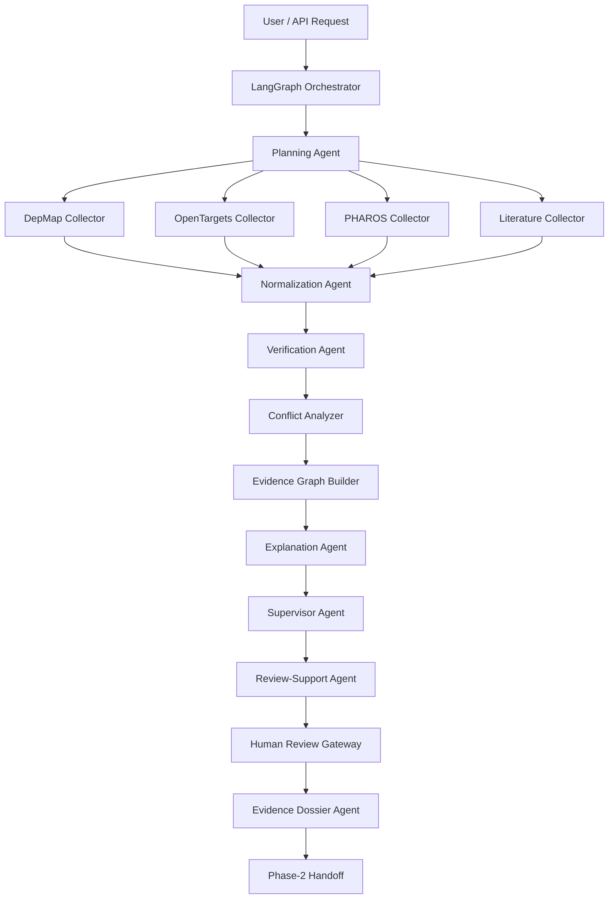

# Phase-1 Architecture (Canonical)

This document defines the canonical architecture for the Phase-1 Evidence Collector.

## Source of Truth
- [WHAT_WE_ARE_BUILDING.md](/Users/apple/Desktop/Drugagent/docs/WHAT_WE_ARE_BUILDING.md)
- [COMPLETE_FLOW_AND_RESPONSIBILITIES.md](/Users/apple/Desktop/Drugagent/docs/COMPLETE_FLOW_AND_RESPONSIBILITIES.md)
- [PRD_PHASE1_EVIDENCE_COLLECTOR.md](/Users/apple/Desktop/Drugagent/docs/PRD_PHASE1_EVIDENCE_COLLECTOR.md)

If this file conflicts with the documents above, update this file.

## Runtime Flow

```text
validate_input
  -> plan_collection
  -> collect_sources_parallel
  -> normalize_evidence
  -> verify_evidence
  -> analyze_conflicts
  -> build_evidence_graph
  -> generate_explanation
  -> supervisor_decide
  -> prepare_review_brief
  -> human_review_gate
  -> emit_dossier
```

## System Topology



## Code-Level Mapping (Current Repo)

- Orchestration graph: `agents/graph.py`
- Runtime state model: `agents/state.py`
- Contracts and schema: `agents/schema.py`
- Source runtime dispatcher: `agents/mcp_runtime.py`
- Summary/explanation logic: `agents/summary_agent.py`
- Source server lifecycle helper: `agents/server_manager.py`
- MCP service entrypoint: `mcps/server.py`
- CLI entrypoint: `cli/main.py`

## Data Sources (Phase-1)

- DepMap
- OpenTargets
- PHAROS
- Literature (Europe PMC / PubMed style evidence retrieval path)

No additional sources are in scope unless explicitly approved.

## Reliability and Safety Constraints

- Evidence claims must be grounded in verified evidence records.
- Provenance is mandatory for evidence output.
- Contradictions must be surfaced, not hidden.
- Human review gate must remain in the pipeline.
- Phase-1 must not claim Phase-2 completion.
