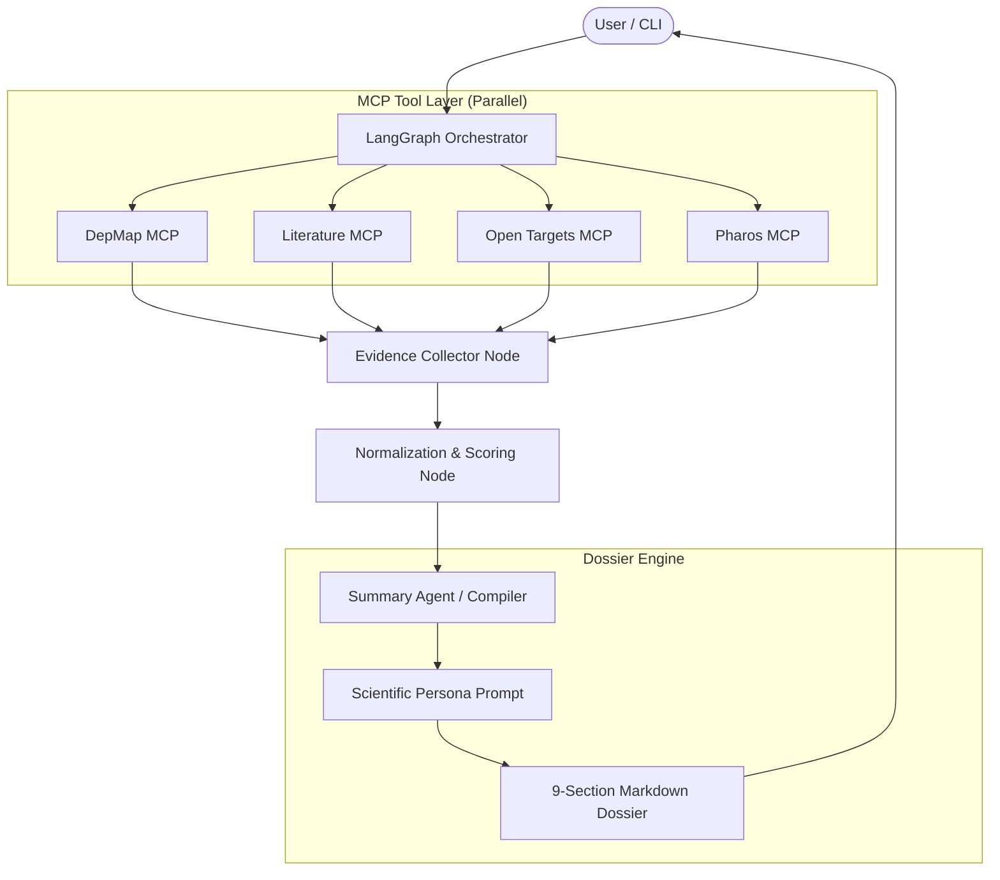

# 🏗️ Agent4Target Architecture Summary

Agent4Target is an advanced drug discovery agentic ecosystem that leverages the **Model Context Protocol (MCP)** and **LangGraph** to deliver deep biological insights.

## 🔄 The Integrated Synthesis Workflow

The system follows a deterministic orchestration pattern to ensure high-fidelity reporting.

### 1. Multi-Source Orchestration
The **LangGraph Orchestrator** manages parallel collection from four distinct evidence streams:
- **Internal MCPs**: Custom-built servers for **DepMap** (Cancer Dependency) and **Literature** (Europe PMC).
- **External MCPs**: Wrappers for **Open Targets** (official platform) and **Pharos** (NIH community server).

### 2. Evidence Processing & Normalization
Once the raw evidence is collected, the system performs:
- **Deduplication**: Merging overlapping findings across sources.
- **Normalization**: Translating diverse metrics (e.g., CRISPR effect scores vs. p-values) into a unified scale.
- **Robustness Check**: Verifying if the collected evidence meets the minimum coverage threshold for a reliable assessment.

### 3. LLM-Based Dossier Compilation
A specialized **Summary Agent** (Report Compiler) takes the normalized data and generates a professional pharmaceutical dossier.
- **Strict Role**: Acts as a "Therapeutic Target Evidence Report Compiler."
- **Deterministic Structure**: Mandates a 9-section report format including Executive Summary, Genetic Dependencies, Disease Associations, and Literature Evidence.
- **Numeric Precision**: Ensures every finding is grounded in the underlying data with exact numeric values.

## 📊 System Topology

## 📉 Execution Trace
Every run produces a fully auditable JSON trace allowing developers to inspect the raw data returned by each MCP tool before synthesis.
