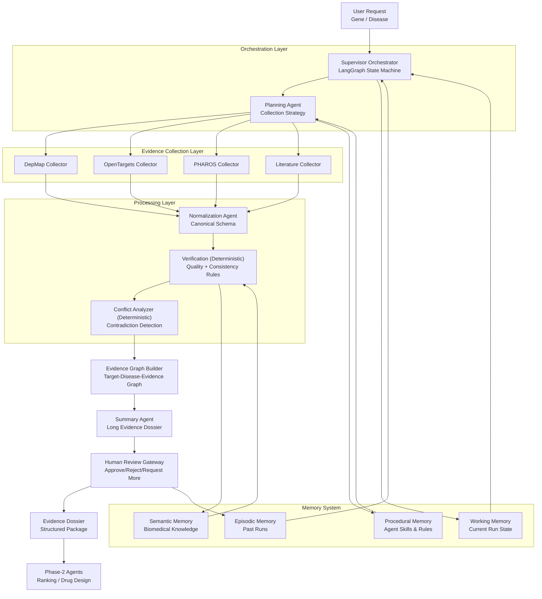

# Complete Flow and Responsibilities
## Phase-1 Evidence Collector Context Document

**Version:** 1.0  
**Date:** March 9, 2026  
**Purpose:** Single source of truth for what we are building, how it works end-to-end, and each component's responsibilities.

---

## Canonical Intent Reference

Use this document together with:
- [WHAT_WE_ARE_BUILDING.md](/Users/apple/Desktop/Drugagent/docs/WHAT_WE_ARE_BUILDING.md)

`WHAT_WE_ARE_BUILDING.md` defines product intent and anti-hallucination guardrails.

---

## 1. Why This Document Exists

This document is the implementation context for the Phase-1 Evidence Collector system. It complements the PRD by focusing on complete execution flow and engineering ownership boundaries.

Use this document when you need to answer:
- What exactly does this system do?
- What are the stages in order?
- What does each agent/component own?
- What data enters/leaves every stage?
- What happens on failures and review outcomes?

---

## 2. System Mission

Given a target gene (and optional disease context), the system must:
1. Plan evidence collection strategy.
2. Collect biomedical evidence from multiple sources in parallel.
3. Normalize evidence into one canonical format.
4. Verify quality and consistency.
5. Detect contradictions across evidence.
6. Build an evidence graph representation.
7. Produce a clear evidence summary.
8. Pass through human review approval.
9. Emit a structured dossier for downstream agents.

---

## 3. End-to-End Architecture Flow

This repository currently runs a **lean, artifact-first flow** by default:
- Deterministic processing stages produce the plan, verification report, conflicts, and graph snapshot.
- Only a small set of LLM agents are used for planning/synthesis/decisioning (when quota allows).
- Extra "commentary" agents (per-source reviews, LLM verification/conflict interpretation, graph commentary, dossier commentary) are **not part of the default runtime flow** and have been moved under `agents/optional_agents/`.



---

## 4. Runtime Flow (Detailed)

### Stage 0: Input Intake
- **Input:** `gene_symbol` (required), `disease_id` (optional), source controls, top-k controls.
- **Output:** validated `CollectorRequest`.
- **Responsibility:** reject malformed requests early with typed error messages.

### Stage 1: Supervisor Orchestrator
- Owns run lifecycle and state transitions.
- Creates `run_id` and checkpointable state.
- Controls retries, timeout budgets, and partial-failure policy.

### Stage 2: Planning Agent
- Creates run plan with:
  - selected sources
  - per-source intent
  - fallback policy
  - retry priority order
- Writes plan into working memory and run artifact.

### Stage 3: Parallel Evidence Collectors
- DepMap, OpenTargets, PHAROS, Literature execute concurrently.
- Each collector returns:
  - normalized candidate items (or raw payload for later normalization)
  - source status
  - typed errors
  - execution timing

### Stage 4: Normalization Agent
- Converts all evidence to canonical `EvidenceRecord` shape.
- Harmonizes score/confidence formats and units.
- Attaches provenance metadata for every record.

### Stage 5: Verification Agent
- Applies strict deterministic checks:
  - schema validity
  - provenance completeness
  - duplicate/near-duplicate evidence
  - target symbol mismatch
  - disease ID format mismatch
  - missing citation for literature claims
- Produces `VerificationReport` with pass/fail counts and blocking issues.

### Stage 6: Conflict Analyzer
- Compares evidence assertions across sources.
- Flags contradictions and assigns severity (`low`, `medium`, `high`).
- Produces conflict list for summary + review steps.

### Stage 7: Evidence Graph Builder
- Builds graph edges:
  - target -> disease
  - target -> evidence
  - evidence -> source
  - evidence -> publication
- Emits serializable graph artifact for downstream machine use.

### Stage 8: Explanation Agent
- Produces a long, human-readable dossier grounded in verified evidence only.
- Must include:
  - source coverage
  - confidence profile
  - key supporting findings
  - conflict notes

### Stage 9: Supervisor Agent
- Consumes stage agent reports plus evidence state.
- Decides whether to:
  - recollect evidence
  - request human review
  - proceed to dossier path

### Stage 10: Review-Support Agent
- Prepares concise human review packet.
- Summarizes blocking issues, conflicts, and key reviewer questions.

### Stage 11: Human Review Gateway
- Reviewer can set decision:
  - `approved`
  - `rejected`
  - `needs_more_evidence`
- Decision must be audited with reviewer identity and reason.

### Stage 12: Dossier Emission and Handoff
- Emit final `EvidenceDossier` object.
- Include machine-consumable payload for Phase-2 agents.

---

## 5. Component Responsibilities (Authoritative)

### 5.1 Orchestrator
- State machine execution
- retry/backoff policy
- checkpoint management
- run status lifecycle

### 5.2 Planning Agent
- source selection logic
- plan artifact generation
- execution directives for collectors

### 5.3 Collectors (DepMap/OpenTargets/PHAROS/Literature)
- source-specific query logic
- source-specific parsing
- source error translation to common taxonomy

### 5.4 Normalization Agent
- canonical mapping policy
- score harmonization
- provenance attachment enforcement

### 5.5 Verification Agent
- structural and semantic integrity rules
- blocking/non-blocking issue classification

### 5.6 Conflict Analyzer
- cross-source contradiction rules
- conflict severity calculation

### 5.7 Evidence Graph Builder
- graph entity/edge construction
- graph export contract

### 5.8 Optional Commentary Agents (Not in Default Flow)
These components exist for future use, but are not executed in the default lean flow:
- per-source collector review agent (`SourceCollectionAgent`)
- verification interpretation agent (`VerificationAgent` LLM assessor)
- conflict interpretation agent (`ConflictResolutionAgent` LLM assessor)
- graph commentary agent (`EvidenceGraphAgent` LLM assessor)
- dossier commentary agent (`DossierAgent` LLM assessor)

Implementations live under `agents/optional_agents/`.

### 5.8 Explanation Agent
- dossier narrative synthesis
- no unsupported claims

### 5.9 Human Review Gateway
- decision capture
- approval workflow control
- review audit logging

### 5.10 Memory System
- episodic memory for run outcomes
- semantic memory for curated biomedical facts
- procedural memory for agent rules/versioned prompts
- working memory for live state artifacts

---

## 6. Data Contracts Across the Flow

### 6.1 Input Contract
`CollectorRequest`
- `gene_symbol`
- `disease_id`
- `species`
- `sources`
- `per_source_top_k`
- `max_literature_articles`
- `run_id`

### 6.2 Canonical Evidence Contract
`EvidenceRecord`
- `source`
- `target_id`
- `target_symbol`
- `disease_id`
- `evidence_type`
- `raw_value`
- `normalized_score`
- `confidence`
- `summary`
- `support`
- `provenance`

### 6.3 Stage Artifacts
- `CollectionPlan`
- `VerificationReport`
- `ConflictRecord`
- `EvidenceGraphSnapshot`
- `ReviewDecision`
- `EvidenceDossier`

### 6.4 Final Output Contract
`EvidenceDossier`
- run metadata
- source statuses
- verified evidence list
- verification results
- conflict list
- graph snapshot
- human review decision
- Phase-2 handoff payload

---

## 7. State Machine Contract (Target)

```text
validate_input
  -> plan_collection
  -> collect_sources_parallel
  -> normalize_evidence
  -> verify_evidence
  -> analyze_conflicts
  -> build_evidence_graph
  -> generate_explanation
  -> human_review_gate
  -> emit_dossier
```

If `human_review_gate == needs_more_evidence`:
- route back to `plan_collection` with enriched constraints.

If `human_review_gate == rejected`:
- mark run terminal with rejection reason.

---

## 8. Failure, Retry, and Reliability Behavior

### 8.1 Source Failure Policy
- A single source failure does not terminate run.
- Run can continue if minimum evidence coverage policy is still achievable.

### 8.2 Retry Policy
- Retry transient errors (timeouts, rate limits, temporary upstream failures).
- Use bounded exponential backoff.

### 8.3 Verification Blocking Policy
- Blocking verification failures prevent final dossier emission unless explicitly overridden in review.

### 8.4 Observability Requirements
- Every stage logs start/end, status, duration, and run_id.
- Source-level health metrics are captured per run.

---

## 9. Technical Features Checklist

The complete Phase-1 implementation should include:
- Multi-agent orchestration
- Parallel collectors
- Canonical normalization
- Verification engine
- Conflict analyzer
- Evidence graph generation
- Human-in-the-loop review
- Memory integration
- Provenance and auditability
- Handoff compatibility for Phase-2

---

## 10. Test Coverage for Complete Flow

### 10.1 Must-Have Test Buckets
- Unit tests per stage
- Integration tests per source connector
- State-machine transition tests
- Partial-failure recovery tests
- Conflict detection tests
- Dossier contract tests
- End-to-end smoke tests with known genes

### 10.2 End-to-End Acceptance Scenarios
1. `KRAS + lung cancer`, all sources healthy -> approved dossier emitted.
2. One source timeout -> run completes with partial status and explicit gap reporting.
3. Conflict detected between sources -> review queue populated.
4. Reviewer requests more evidence -> run loops to planner.
5. Reviewer rejects -> run ends with rejection state, no Phase-2 handoff.

---

## 11. Current Build vs Target Build (Context Snapshot)

### Already present
- LangGraph orchestration skeleton
- MCP runtime and source routing
- Core Pydantic request/result contracts
- CLI execution path and markdown output

### Still to implement for complete target
- explicit planning stage artifact
- dedicated normalization stage node
- full verification engine with report model
- explicit conflict analyzer output
- evidence graph artifact layer
- formal human review state + audit trail
- persistent memory subsystem

---

## 12. Responsibility Summary (What This System Does)

This system is responsible for:
- collecting and validating biomedical evidence for a target/disease hypothesis
- transforming heterogeneous source outputs into one trusted evidence package
- surfacing uncertainty and contradictions before downstream automation
- ensuring a human approval checkpoint for scientific safety
- delivering a stable, machine-readable dossier to future drug-discovery agents

This system is not responsible for:
- selecting final therapeutic programs
- generating molecular designs
- replacing scientific decision-making

---

## 13. How To Use This Document During Development

- Use Sections 4 and 7 when implementing graph nodes and transitions.
- Use Section 5 to avoid responsibility overlap between agents.
- Use Section 6 when defining or changing Pydantic schemas.
- Use Sections 8 and 10 when implementing reliability and testing.
- Update Section 11 at the end of each major milestone.
