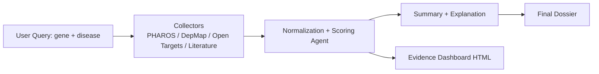

# Architecture Diagram + Scoring & Normalization

This document is the **single retained architecture doc**. It focuses on the scoring/normalization pipeline and the evidence dashboard.

---

## 1) End‑to‑End Flow (High Level)



---

## 2) Scoring & Normalization Flow (Detailed)

```mermaid
flowchart TB
    subgraph S[Source Evidence]
        P[PHAROS record(s)]
        D[DepMap record(s)]
        O[Open Targets record(s)]
        L[Literature record(s)]
    end

    subgraph F[Filtering]
        L --> Lf[Filter: gene appears
as whole word in title OR abstract]
    end

    subgraph N[Normalization]
        P --> Np[TDL → 0‑1]
        D --> Nd[CERES clip + invert → 0‑1]
        O --> No[Use requested disease score
or max across diseases → 0‑1]
        Lf --> Nl[log10(eligible_count + 1)/3 → 0‑1]
    end

    subgraph C[Confidence]
        Cp[Per‑source confidence
(high/medium/low/missing)]
        Co[Overall evidence_confidence
(base‑weight weighted)]
    end

    subgraph W[Weighting + Conflicts]
        Wr[Rebalance weights
only across sources with scores]
        Ts[target_score = Σ(score × weight)]
        Cf[Conflict checks
(pairwise + special DepMap CERES>0 text)]
    end

    P --> Np --> Wr
    D --> Nd --> Wr
    O --> No --> Wr
    Lf --> Nl --> Wr

    Wr --> Ts
    Np --> Cp
    Nd --> Cp
    No --> Cp
    Nl --> Cp
    Cp --> Co

    Ts --> Cf

    Cf --> Out[ScoredTarget + notes]
    Co --> Out
    Ts --> Out
```

---

## 3) Input Contract (per‑source)

Each source is converted to a **SourceEvidence** object before scoring:

- `source`: `pharos | depmap | open_targets | literature`
- `gene`: gene symbol
- `data_present`: did we get any records?
- `total_available`: **eligible count** (not just top‑k)
- `top_k_results`: records shown in UI
- `raw_signal`: the **one key number** for normalization
- `raw_signal_label`: human‑readable label
- `metadata`: extra fields (disease IDs, counts, etc.)

### Raw Signal Mapping
- **PHAROS**: `raw_signal = TDL` (Tdark/Tbio/Tchem/Tclin)
- **DepMap**: `raw_signal = CERES median gene effect`
- **Open Targets**: `raw_signal = association score (0–1)`
- **Literature**: `raw_signal = eligible_hit_count`

---

## 4) Normalization Formulas (easy version)

### PHAROS (TDL → score)
```
Tdark → 0.10
Tbio  → 0.35
Tchem → 0.70
Tclin → 1.00
```

### DepMap (CERES → score)
- Clip CERES into `[-2.0, 0.0]`
- Invert so **more negative = higher score**
```
normalized = (0 - ceres_clipped) / (0 - (-2.0))
```

### Open Targets
- If a disease is requested and present: **use its score**
- Otherwise: **use the max score** across all diseases

### Literature
- Use **eligible hit count** only (title or abstract match)
```
normalized = min( log10(count + 1) / 3.0 , 1.0 )
```

---

## 5) Confidence (separate from score)
Per‑source confidence is based on **how much data existed**, not on how strong it was.

- **PHAROS**: always `high` if present
- **DepMap**: high ≥ 20, medium ≥ 5, else low
- **Open Targets**: high ≥ 5, medium ≥ 2, else low
- **Literature**: high ≥ 100, medium ≥ 10, else low

Overall evidence confidence = weighted average of the per‑source labels using **base weights** (not rebalanced).

---

## 6) Weighting & Rebalancing
Base weights:

- PHAROS: `0.30`
- DepMap: `0.30`
- Open Targets: `0.25`
- Literature: `0.15`

If a source has **no score** (missing), its weight is **redistributed** across the remaining sources, so the final score reflects only what is known.

---

## 7) Conflict Detection
We check key pairs when their normalized scores differ by ≥ 0.50:

- **PHAROS vs DepMap**
- **PHAROS vs Open Targets**
- **DepMap vs Open Targets**

**Special case:**
If DepMap CERES is **positive**, the conflict text says:
> “DepMap shows non‑essentiality (positive CERES)”

This prevents misleading “strong dependency” messages.

---

## 8) Literature Relevance Rule (critical fix)
Only papers where the gene appears as a **whole word in title OR abstract** count toward scoring.

If **eligible = 0** but `hitCount > 0`:
- We emit a `literature_absence` record
- Score uses 0 eligible count
- Total hit count is still shown for transparency

---

## 9) Output Object (ScoredTarget)
The scoring agent emits:

- `target_score` (0–1)
- `evidence_confidence` (0–1)
- `source_scores`, `source_confidences`, `weights_used`
- `conflict_flag`, `conflict_detail`
- `missing_sources`, `sparse_sources`
- `notes` (audit trail)

---

## 10) Evidence Dashboard
The dashboard renders:
- per‑source scores
- weights used
- confidence flags
- conflict messages

This is generated **after scoring** and embedded in the UI.

