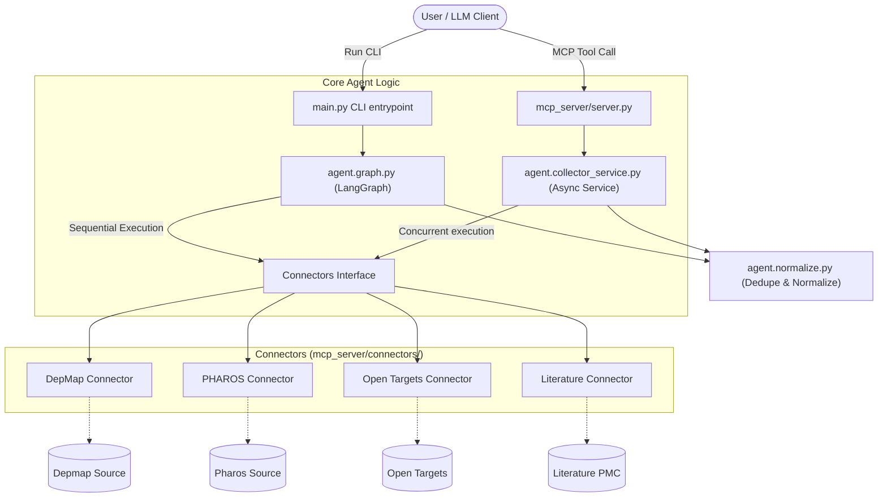
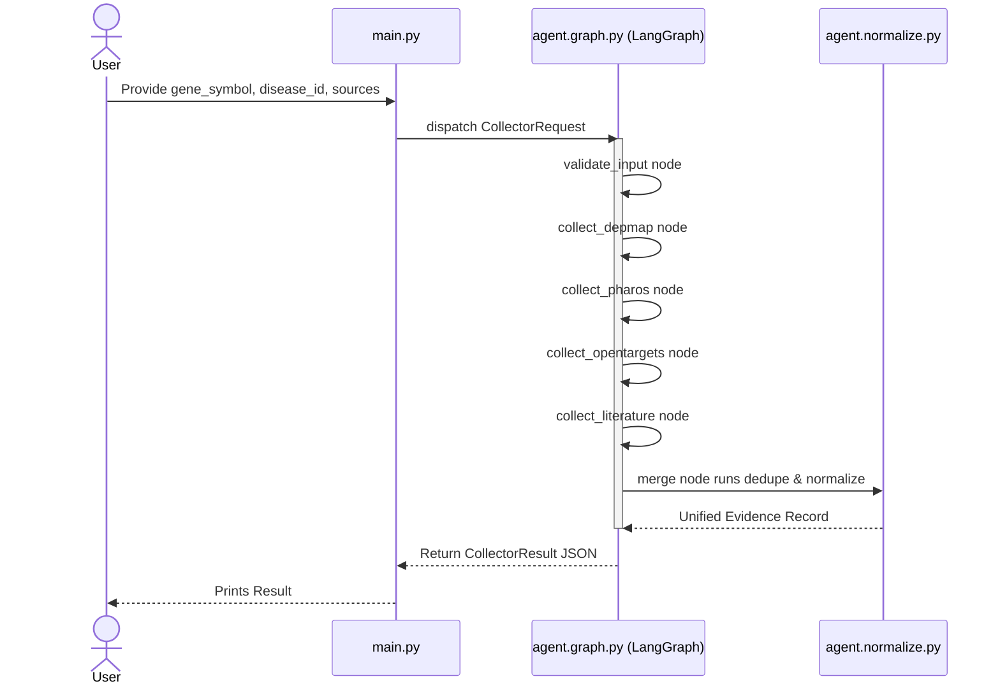
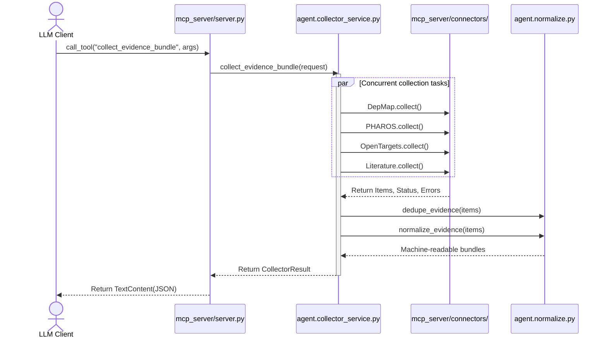

# Agent4Target Architecture and Execution Flow

This document provides a visual representation of how the `Agent4Target` evidence collector application is architected and how its requests flow through the system.

## 1. High-Level Architecture Overview

The project provides two primary interfaces to interact with the underlying evidence connectors (DepMap, PHAROS, Open Targets, and Literature):

1. **Standalone CLI (`main.py`)**: A local command-line tool that orchestrates data collection sequentially using **LangGraph**.
2. **MCP Server (`mcp_server/server.py`)**: A Model Context Protocol server that exposes these connectors as standalone tools or as a bundled concurrent executor using **Asyncio**.

---

## 2. CLI Execution Flow (LangGraph)

When executing via `main.py`, the flow uses **LangGraph** where the connectors are orchestrated sequentially as graph nodes. The state is accumulated as it flows through the graph.

---

## 3. MCP Server Execution Flow

When acting as an MCP server, the flow changes. LLMs can either call an individual tool (e.g., `collect_depmap_evidence`) or they can call the `collect_evidence_bundle` tool which runs everything natively in parallel via `asyncio.gather`.

## Details on Data Structures (`agent/schema.py`)

Regardless of the execution path, the standard inputs and outputs remain the same:
* **Input**: `CollectorRequest` which must contain a `gene_symbol` (e.g., "EGFR"), and optionally `disease_id` and specific `sources`.
* **Output**: `CollectorResult` aggregating individual `EvidenceRecord`s, execution state, and deterministic run metrics.
