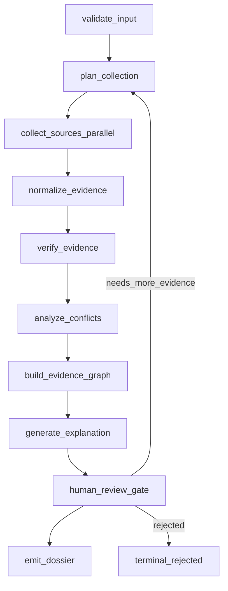

# Architecture Flow (Detailed)

This document provides the execution flow view for the Phase-1 Evidence Collector.

## Canonical Stage Sequence

## Stage Responsibilities

1. `validate_input`  
Validate query contract and initialize run metadata.

2. `plan_collection`  
Create source plan, fallback strategy, and execution directives.

3. `collect_sources_parallel`  
Collect from DepMap/OpenTargets/PHAROS/Literature concurrently.

4. `normalize_evidence`  
Map raw payloads into canonical evidence schema.

5. `verify_evidence`  
Run integrity checks (schema/provenance/mapping/citations/duplicates).

6. `analyze_conflicts`  
Detect and classify contradictory evidence.

7. `build_evidence_graph`  
Build relation graph (Target, Disease, Evidence, Publication, Source).

8. `generate_explanation`  
Create grounded summary from verified evidence.

9. `human_review_gate`  
Apply review decision: approved / rejected / needs_more_evidence.

10. `emit_dossier`  
Emit final `EvidenceDossier` and downstream handoff payload.

## Interfaces in This Repository

- Graph orchestration: `agents/graph.py`
- Shared state: `agents/state.py`
- Contracts: `agents/schema.py`
- MCP dispatch/runtime: `agents/mcp_runtime.py`
- Bundle collection service: `agents/collector_service.py`
- CLI runtime entry: `cli/main.py`
- MCP tool entry: `mcps/server.py`

## Alignment Rule

All implementation changes must stay aligned with:
- [WHAT_WE_ARE_BUILDING.md](/Users/apple/Desktop/Drugagent/docs/WHAT_WE_ARE_BUILDING.md)
- [COMPLETE_FLOW_AND_RESPONSIBILITIES.md](/Users/apple/Desktop/Drugagent/docs/COMPLETE_FLOW_AND_RESPONSIBILITIES.md)
- [TRACEABILITY_MATRIX_PRD_FLOW_TASKS.md](/Users/apple/Desktop/Drugagent/docs/TRACEABILITY_MATRIX_PRD_FLOW_TASKS.md)
