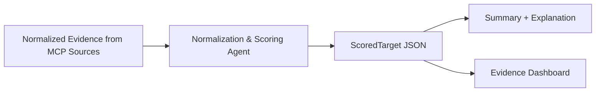

# Scoring Agent Diagram + Reference

This document focuses **only** on the Normalization & Scoring Agent. It is separate from the general architecture overview.

---

## 1) Scoring Agent Position in the Pipeline



---

## 2) Scoring Agent Internal Flow

```mermaid
flowchart TB
    subgraph Inputs
        P[PHAROS SourceEvidence]
        D[DepMap SourceEvidence]
        O[Open Targets SourceEvidence]
        L[Literature SourceEvidence]
    end

    subgraph Filter
        L --> Lf[Filter: gene in title OR abstract]
    end

    subgraph Normalize
        Np[PHAROS: TDL → 0‑1]
        Nd[DepMap: CERES clip + invert → 0‑1]
        No[Open Targets: requested disease or max]
        Nl[Literature: log10(eligible + 1)/3]
    end

    subgraph Confidence
        Cp[Per‑source confidence labels]
        Co[Overall evidence_confidence
(base‑weight weighted)]
    end

    subgraph Score
        Wr[Rebalance weights across active sources]
        Ts[target_score = Σ(score × weight)]
    end

    subgraph Conflicts
        Cf[Pairwise conflict checks
(DepMap CERES>0 special text)]
    end

    P --> Np --> Wr
    D --> Nd --> Wr
    O --> No --> Wr
    Lf --> Nl --> Wr

    Wr --> Ts

    Np --> Cp
    Nd --> Cp
    No --> Cp
    Nl --> Cp
    Cp --> Co

    Ts --> Cf
    Cf --> Out[ScoredTarget + notes]
    Co --> Out
    Ts --> Out
```

---

## 3) Core Formulas (Simple)

### PHAROS
```
Tdark → 0.10
Tbio  → 0.35
Tchem → 0.70
Tclin → 1.00
```

### DepMap
```
ceres_clipped = min(0.0, max(-2.0, ceres))
normalized = (0 - ceres_clipped) / 2.0
```

### Open Targets
```
if requested_disease exists:
  score = that disease
else:
  score = max(all disease scores)
```

### Literature (eligible only)
```
normalized = min(log10(eligible_count + 1) / 3.0, 1.0)
```

---

## 4) Weighting

Base weights:
- PHAROS: 0.30
- DepMap: 0.30
- Open Targets: 0.25
- Literature: 0.15

If a source is missing (no score), weights are **rebalanced** across the remaining sources.

---

## 5) Conflict Logic (Key Note)

If DepMap CERES is **positive**, conflict messages say:
> “DepMap shows non‑essentiality (positive CERES)”

This avoids misleading “strong dependency” language.

---

## 6) Output (ScoredTarget)

The scoring agent outputs:
- `target_score`
- `evidence_confidence`
- `source_scores`
- `source_confidences`
- `weights_used`
- `conflict_flag`, `conflict_detail`
- `missing_sources`, `sparse_sources`
- `notes`

